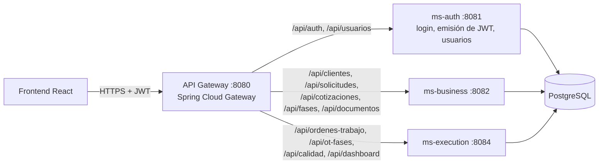

# QualityTrack · Backend (microservicios)

API REST para la gestión de calidad y órdenes de trabajo de un taller que fabrica piezas para la industria minera: solicitudes comerciales, cotizaciones, órdenes de trabajo por fases, auditorías de calidad y entrega, con permisos por rol.

## Arquitectura



- **api-gateway**: punto de entrada único, enrutamiento y CORS. No valida tokens: cada microservicio es responsable de su seguridad.
- **ms-auth**: autenticación con email y contraseña (BCrypt) y emisión de JWT con el rol del usuario.
- **ms-business**: clientes, solicitudes, cotizaciones, catálogo de fases y documentos adjuntos.
- **ms-execution**: órdenes de trabajo, ejecución de fases, notas, auditorías de calidad y dashboards.
- **ms-common**: librería compartida (entidades JPA, repositorios, validación de JWT, configuración de seguridad y manejo global de errores).

Cada microservicio valida el JWT emitido por ms-auth con la misma clave (`JWT_SECRET`) y autoriza por rol con `@PreAuthorize`.

## Stack

| | |
|---|---|
| Lenguaje | Java 21 |
| Framework | Spring Boot 3.3.3, Spring Cloud 2023.0.3 (Gateway) |
| Seguridad | Spring Security, JWT (auth0 java-jwt), BCrypt |
| Persistencia | Spring Data JPA / Hibernate, PostgreSQL |
| Infraestructura | Docker (imagen multi-stage por servicio), Docker Compose |
| Build | Maven multi-módulo |

## Flujo de negocio

```
Solicitud (VENDEDOR) → Cotización (JEFE_PRODUCCION) → aprobación del cliente (VENDEDOR)
   → Orden de Trabajo generada automáticamente → ejecución de fases (OPERARIO)
   → Auditoría de calidad: conforme / no conforme con retrabajo (CALIDAD) → Entrega (VENDEDOR)
```

Roles: `GERENTE`, `VENDEDOR`, `JEFE_PRODUCCION`, `OPERARIO`, `CALIDAD`.

## Cómo levantarlo

Requisitos: Docker Desktop. Para desarrollo sin Docker, JDK 21 y Maven (o el wrapper `mvnw`).

```bash
cd backend/qualititrack
cp .env.example .env        # completar con tus valores (nunca se sube al repo)
docker compose up --build
```

Healthchecks: `http://localhost:8080/actuator/health` (gateway), `:8081`, `:8082` y `:8084` para cada servicio.

Build sin Docker:

```bash
./mvnw clean package -DskipTests
```

## Variables de entorno

| Variable | Servicios | Descripción |
|---|---|---|
| `DB_HOST`, `DB_NAME` | ms-auth, ms-business, ms-execution | Host y base de PostgreSQL |
| `DB_USER`, `DB_PASSWORD` | ms-auth, ms-business, ms-execution | Credenciales de la base |
| `JWT_SECRET` | ms-auth, ms-business, ms-execution | Clave HMAC para firmar y validar los JWT (la misma en los 3) |
| `JWT_ISSUER` | ms-auth, ms-business, ms-execution | Emisor del token (por defecto `qualitytrack`) |
| `JWT_EXPIRATION_MINUTES` | ms-auth | Duración del token (por defecto 30) |
| `MS_AUTH_URL`, `MS_BUSINESS_URL`, `MS_EXECUTION_URL` | api-gateway | URLs de los microservicios |
| `CORS_ALLOWED_ORIGINS` | api-gateway | Orígenes permitidos para el frontend |
| `PORT` | api-gateway | Puerto del gateway (por defecto 8080) |

## Endpoints principales

Todas las rutas se consumen a través del gateway (`http://localhost:8080`). Salvo `/api/auth/**`, requieren el header `Authorization: Bearer <token>`.

| Servicio | Endpoint | Rol |
|---|---|---|
| ms-auth | `POST /api/auth/login` | público |
| ms-auth | `POST /api/auth/register` (crea siempre usuarios OPERARIO) | público |
| ms-auth | `POST /api/usuarios` (alta con cualquier rol) | GERENTE |
| ms-auth | `GET /api/usuarios`, `GET /api/usuarios/activos` | GERENTE |
| ms-business | `POST/GET/PUT /api/clientes` · `DELETE /api/clientes/{id}` | VENDEDOR, JEFE_PRODUCCION, GERENTE · GERENTE |
| ms-business | `POST /api/solicitudes` · `GET /api/solicitudes` | VENDEDOR · VENDEDOR, JEFE_PRODUCCION |
| ms-business | `POST /api/cotizaciones` | JEFE_PRODUCCION |
| ms-business | `POST /api/cotizaciones/{id}/aprobar` · `/rechazar` | VENDEDOR |
| ms-business | `GET/POST/PUT /api/fases` | GERENTE (lectura también JEFE_PRODUCCION) |
| ms-business | `POST /api/documentos` (multipart) | VENDEDOR |
| ms-execution | `GET /api/ordenes-trabajo`, `PUT /api/ordenes-trabajo/{id}/estado` | JEFE_PRODUCCION, OPERARIO |
| ms-execution | `POST /api/ordenes-trabajo/{id}/entrega` | VENDEDOR |
| ms-execution | `POST /api/ot-fases/{id}/iniciar` · `/finalizar` | OPERARIO |
| ms-execution | `POST /api/ot-fases/{id}/reasignar` | JEFE_PRODUCCION |
| ms-execution | `POST /api/calidad/{id}/conforme` · `/no-conforme` | CALIDAD |
| ms-execution | `GET /api/dashboard/calidad` · `/planta` | GERENTE, JEFE_PRODUCCION, CALIDAD · GERENTE |

## Seguridad

Ver [SECURITY.md](../../SECURITY.md).

## Equipo

Proyecto desarrollado en equipo en la simulación laboral de No Country. Integrantes y roles en el [README principal](../../README.md).
