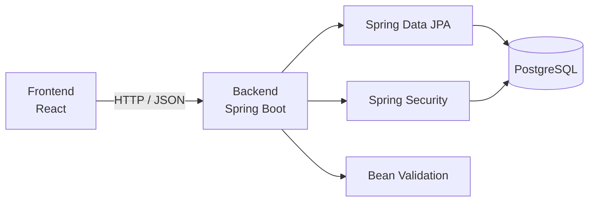

# Especificación técnica

## Arquitectura general

Se utiliza una arquitectura cliente-servidor, donde el frontend se comunica con el backend a través de una REST API, organizada de manera modular para los diferentes tipos de acceso (Vendedor, Jefe de producción, Operario, Calidad, Gerente), que a su vez gestiona una base de datos PostgreSQL.



## Stack tecnológico

### Desarrollo

- **Backend:** *Java + Spring Boot*, por su robustez y facilidad para crear REST APIs e implementar servicios de seguridad y autenticación a través de Spring Security, así como también diversos otros servicios que cubran todos los requerimientos del proyecto.
- **Frontend:** *React*, por su popularidad y eficiencia en la creación de interfaces de usuario dinámicas.
- **Base de datos:** *PostgreSQL*, por su fiabilidad y soporte para relaciones complejas entre datos. Además, una de las opciones más recomendadas para el despliegue gratuito de bases de datos (Neon) solo acepta PostgreSQL.

## Estructura del proyecto

```text
backend/
├── pom.xml
├── README.md
├── .env.example
└── src/
    ├── main/
    │   ├── java/com/qualitytrack/
    │   │   ├── QualityTrackApplication.java
    │   │   ├── config/       # Beans globales, CORS
    │   │   ├── controller/   # endpoints REST
    │   │   ├── dto/          # objetos de transferencia de datos
    │   │   ├── enum/         # enumeraciones
    │   │   ├── exception/    # GlobalExceptionHandler (@RestControllerAdvice)
    │   │   ├── modelos/      # entidades JPA
    │   │   ├── repository/   # repositorios Spring Data JPA
    │   │   ├── security/     # Filtro JWT, UserDetailsService, roles
    │   │   ├── service/      # lógica de negocio
    │   │   └── utils/        # clases utilitarias (mappers, validadores, etc.)
    │   └── resources/
    │       ├── application.properties
    │       └── application-dev.properties
    └── test/
```

Cada una de las entidades de las tablas del [Esquema v2](../datos/QualityTrack-Esquema-Base-Datos-v2.md) son mapeadas a clases JPA dentro del paquete `modelos`, y a su vez cuentan con las siguientes clases en las carpetas correspondientes, esperables en una arquitectura Model-View Controller (MVC):

- **Controller:** recibe las solicitudes HTTP y devuelve las respuestas de la API.
- **Service:** contiene la lógica de negocio y las reglas del proceso.
- **Repository:** gestiona el acceso a PostgreSQL mediante Spring Data JPA.
- **Entity:** representa las entidades persistidas en la base de datos.
- **DTO:** define los objetos utilizados para entrada y salida de la API.
- **Mapper:** realiza la conversión entre Entity y DTO.

## Autenticación y autorización

En esta sección, se desarrolla cómo se identifica a cada usuario y cómo se restringe cada dashboard usando los roles ya cerrados (Vendedor, Jefe de producción, Operario, Calidad, Gerente).

Para autorizar el acceso a los distintos endpoints de la API, se implementará un sistema de roles mediante Spring Security. Los roles a identificar son los siguientes:

- Vendedor (ROLE_SALES)
- Jefe de producción (ROLE_PRODUCTION)
- Operario (ROLE_OPERATOR)
- Calidad (ROLE_QUALITY)
- Gerente (ROLE_MANAGER)

Para la identificación de usuarios, se utilizarán JWT (JSON Web Tokens). Cuando los usuarios inician sesión con sus credenciales, Spring Security las valida con la base de datos y devuelve un token JWT codificado que lo identifica junto a su rol.

## Manejo de errores y validaciones

Para validaciones de entrada, se usa Jakarta Bean Validation en los DTO (`@NotNull`, `@NotBlank`, `@Positive`, etc.), de forma que los datos obligatorios y sus formatos se chequean antes de llegar a la capa de servicio. Las reglas de negocio (las que dependen de datos ya persistidos, no solo del formato del body) se validan en la capa Service — no alcanza con las validaciones del Frontend.

Para el resto de los errores, se centraliza el manejo con un `@RestControllerAdvice` global, que traduce cada excepción de negocio al código HTTP correspondiente. Los códigos coinciden con los que ya espera el Frontend — ver [Especificación Técnica Frontend §8](../frontend/Especificacion-Tecnica.md):

| Excepción                                   | Código HTTP | Cuándo se lanza                                                                                                                  |
| -------------------------------------------- | ----------- | ----------------------------------------------------------------------------------------------------------------------------------- |
| `MethodArgumentNotValidException` (Jakarta) | 400         | El body no cumple las validaciones del DTO                                                                                       |
| `AuthenticationException`                   | 401         | Token ausente, inválido o expirado                                                                                              |
| `AccessDeniedException`                     | 403         | El rol del usuario no tiene permiso para el endpoint                                                                            |
| `EntityNotFoundException` (custom)          | 404         | El recurso solicitado (solicitud, cotización, OT, fase, etc.) no existe                                                        |
| `InvalidStateException` (custom)            | 409         | La operación pedida no es válida para el estado actual del recurso (ej. aprobar una cotización que no está `ENVIADA_A_CLIENTE`) |
| Cualquier otra excepción no controlada      | 500         | Error interno — se loguea completo, se devuelve un mensaje genérico                                                             |

Todas las respuestas de error devuelven un body consistente: `{ "mensaje": "...", "detalles": [...] }` (`detalles` solo se completa en 400, con un item por campo inválido).

## Contratos de API

Se desarrollan los endpoints a utilizar en el sistema, agrupados por módulo — el mismo agrupamiento que ya usa la [Especificación Técnica de Frontend §6](../frontend/Especificacion-Tecnica.md), para que ambos documentos se lean en paralelo sin traducir nombres.

Se detalla por cada endpoint: método HTTP, ruta, rol que puede usarlo, qué espera recibir y qué devuelve.

**Los valores de estado (`estado`, `rol`, `resultado`, `resultado_item`, `tipo_archivo`, etc.) no se redefinen en este documento.** Son exactamente los que fija el [Esquema v2](../datos/QualityTrack-Esquema-Base-Datos-v2.md) — cualquier body o respuesta que use un valor de estado referencia esa fuente, nunca uno propio.

### Autenticación

#### Login

- Método HTTP: POST
- Ruta: `/api/auth/login`
- Roles: cualquiera (público, sin JWT previo)
- Body: `{ "email": "...", "password": "..." }`
- Respuesta exitosa: 200 OK `{ "token": "...", "rol": "VENDEDOR", "nombre": "..." }`
- Respuesta de error: 401 (credenciales inválidas)

### Módulo Vendedor

#### Crear solicitud (HU-1.1)

- Método HTTP: POST
- Ruta: `/api/solicitudes`
- Roles: Vendedor
- Body: `{ cliente_id, descripcion_pieza, cantidad, fecha_esperada_entrega, notas_comerciales }`
- Respuesta exitosa: 201 Created `{ id, numero_solicitud, estado }` (`estado` inicial: `PENDIENTE_COTIZACION`)
- Respuesta de error: 400 (falta un campo obligatorio del cliente, la pieza o la cantidad)

#### Subir documento adjunto (HU-1.1)

- Método HTTP: POST
- Ruta: `/api/documentos`
- Roles: Vendedor
- Body: multipart — `solicitud_id`, `archivo`, `tipo_archivo` (`PLANO`, `CERTIFICADO`, `ESPECIFICACION`, `OTRO`)
- Respuesta exitosa: 201 Created `{ id, nombre_original, tipo_archivo, ruta_almacenamiento }`
- Respuesta de error: 400 (tipo de archivo no permitido o solicitud inexistente)

#### Expediente completo de la OT (HU-1.2)

- Método HTTP: GET
- Ruta: `/api/ordenes-trabajo/{id}/expediente`
- Roles: Vendedor
- `{id}` acepta el id interno o el `numero_ot`.
- Respuesta exitosa: 200 OK — solicitud, cotización (fases, tiempos, precio), historial de operaciones por fase (incluyendo reasignaciones y retrabajos), resultado de Calidad, estado de entrega. Se arma sobre la vista `v_ot_expediente` (Esquema v2 §05) más las tablas de historial (`ot_fase_reasignaciones`, `ot_fases` con `es_rehacer`).
- Respuesta de error: 404 (no existe la OT)
- ⚠️ Frontend no documenta un endpoint separado de búsqueda por número/cliente para llegar a este `{id}` — a confirmar con Alicia cómo se resuelve esa búsqueda antes de abrir el expediente.

#### Listar cotizaciones (HU-1.3)

- Método HTTP: GET
- Ruta: `/api/cotizaciones`
- Roles: Vendedor
- Respuesta exitosa: 200 OK — cotizaciones derivadas para el vendedor, con fases, tiempos y precio final.

#### Registrar respuesta del cliente (HU-1.3)

- Método HTTP: PUT
- Ruta: `/api/cotizaciones/{id}`
- Roles: Vendedor
- Uso: marcar `fecha_envio_cliente` cuando el Vendedor le envía la cotización al cliente. El registro de aprobado/rechazado va por los dos endpoints siguientes, no por este PUT.
- Respuesta exitosa: 200 OK `{ id, estado, fecha_envio_cliente }`

#### Aprobar cotización (HU-1.3)

- Método HTTP: POST
- Ruta: `/api/cotizaciones/{id}/aprobar`
- Roles: Vendedor
- Respuesta exitosa: 200 OK `{ id, estado: "APROBADA" }` — dispara la generación automática de la OT (`ordenes_trabajo`) y deriva la primera fase a la cola de su operario.
- Respuesta de error: 409 (la cotización no está `ENVIADA_A_CLIENTE`)

#### Rechazar cotización (HU-1.3)

- Método HTTP: POST
- Ruta: `/api/cotizaciones/{id}/rechazar`
- Roles: Vendedor
- Body: `{ motivo_rechazo_cliente }`
- Respuesta exitosa: 200 OK `{ id, estado: "NO_APROBADA" }` — **no genera ninguna OT y no vuelve al Jefe de producción.** La cotización queda cerrada; si hace falta recotizar, se carga una solicitud nueva (D7 del Esquema v2 — este MVP no versiona cotizaciones rechazadas).
- Respuesta de error: 409 (la cotización no está `ENVIADA_A_CLIENTE`)

#### Registrar entrega (HU-1.4)

- Método HTTP: POST
- Ruta: `/api/ordenes-trabajo/{id}/entrega`
- Roles: Vendedor
- Body: `{ receptor_nombre }`
- Respuesta exitosa: 200 OK `{ id, estado: "ENTREGADA", fecha_entrega, receptor_nombre }`
- Respuesta de error: 409 (la OT no está en estado `DESPACHO`)

### Módulo Jefe de producción

#### Listar solicitudes pendientes (HU-2.1)

- Método HTTP: GET
- Ruta: `/api/solicitudes`
- Roles: Jefe de producción
- Respuesta exitosa: 200 OK — solicitudes en estado `PENDIENTE_COTIZACION`, con la documentación adjunta, la descripción de la pieza y la cantidad.

#### Crear cotización con fases (HU-2.1)

- Método HTTP: POST
- Ruta: `/api/cotizaciones`
- Roles: Jefe de producción
- Body:
  ```json
  {
    "solicitud_id": 1,
    "precio_final": 15000.00,
    "fases": [
      {
        "fase_catalogo_id": 1,
        "numero_secuencia": 1,
        "tiempo_estimado_minutos": 120,
        "instrucciones_fase": "Corte por láser según plano"
      }
    ]
  }
  ```
  Una misma `fase_catalogo_id` puede repetirse con distinto `numero_secuencia` (D6 del Esquema v2).
- Respuesta exitosa: 201 Created `{ id, numero_cotizacion, estado: "LISTA_PARA_ENVIAR" }`
- Respuesta de error: 400 (faltan datos, o `numero_secuencia` repetido dentro de la misma cotización)

#### Consultar fases asignadas / gestión de planta (HU-2.2)

- Método HTTP: GET
- Ruta: `/api/ot-fases`
- Roles: Jefe de producción, Operario
- Query params: `operario_id`, `estado` — el Jefe consulta sin filtrar por operario para ver la carga de todos; el Operario recibe solo lo suyo (ver también Módulo Operario).
- Respuesta exitosa: 200 OK — lista de `ot_fases` con OT, fase, operario, `tiempo_estimado_minutos`, `fecha_vencimiento`, `estado`.

#### Reasignar fase (HU-2.2)

- Método HTTP: POST
- Ruta: `/api/ot-fases/{id}/reasignar`
- Roles: Jefe de producción
- Body: `{ operario_nuevo_id, motivo }` (`operario_anterior_id` y `reasignado_por_id` se resuelven server-side)
- Respuesta exitosa: 200 OK `{ id, operario_id }` — además crea la fila en `ot_fase_reasignaciones` (D12), visible después en el expediente (HU-1.2).
- Respuesta de error: 409 (el operario nuevo no está habilitado para la fase — R3)

#### Crear fase de retrabajo (HU-2.3)

- Método HTTP: POST
- Ruta: `/api/ot-fases`
- Roles: Jefe de producción
- Body: `{ orden_trabajo_id, fase_catalogo_id, operario_id, tiempo_estimado_minutos, nota }`
- El backend calcula server-side `es_rehacer = TRUE` y `ciclo_iteracion + 1` (R8) — no se reciben del cliente. También crea la `ot_notas` correspondiente con `origen = JEFE_PRODUCCION`.
- Respuesta exitosa: 201 Created `{ id, numero_secuencia, ciclo_iteracion, es_rehacer: true }`

### Módulo Operario

#### Tareas asignadas (HU-3.1)

- Método HTTP: GET
- Ruta: `/api/ot-fases` (mismo endpoint que usa el Jefe de producción para gestión de planta — ver arriba)
- Roles: Operario
- Respuesta exitosa: 200 OK — tareas del operario autenticado, en cola y en ejecución, con `fecha_vencimiento` ya calculada.

#### Iniciar fase (HU-3.1)

- Método HTTP: POST
- Ruta: `/api/ot-fases/{id}/iniciar`
- Roles: Operario
- Respuesta exitosa: 200 OK `{ id, estado: "EN_EJECUCION", fecha_inicio_real }`
- Respuesta de error: 409 (la fase no está `EN_COLA`)

#### Finalizar fase (HU-3.1)

- Método HTTP: POST
- Ruta: `/api/ot-fases/{id}/finalizar`
- Roles: Operario
- Respuesta exitosa: 200 OK `{ id, estado: "TERMINADO", fecha_fin_real, duracion_real_minutos }`. Si existe fase siguiente en la secuencia, la deriva a la cola de su operario; si no, pasa la OT a `EN_CALIDAD` y sella `ordenes_trabajo.fecha_pase_calidad` (R12 — es la marca que después mide el tiempo promedio en Calidad de HU-5.4).
- Respuesta de error: 409 (la fase no está `EN_EJECUCION`)

#### Adjuntos de la solicitud (HU-3.2)

- Método HTTP: GET
- Ruta: `/api/solicitudes/{id}/documentos`
- Roles: Operario
- El `{id}` es de `solicitudes`, no de la OT — los adjuntos cuelgan de la solicitud (Esquema v2 §2.6); el Operario llega navegando desde su fase.
- Respuesta exitosa: 200 OK — lista de adjuntos con nombre y enlace de descarga.

#### Notas de la fase (HU-3.4)

- Método HTTP: GET
- Ruta: `/api/ot-fases/{id}/notas`
- Roles: Operario
- Respuesta exitosa: 200 OK — notas separadas por `origen` (`CALIDAD`, `JEFE_PRODUCCION`), nunca mezcladas en una misma lista (R7).

### Módulo Calidad

#### Órdenes pendientes de auditoría (HU-4.1)

- Método HTTP: GET
- Ruta: `/api/calidad`
- Roles: Calidad
- Respuesta exitosa: 200 OK — OTs en estado `EN_CALIDAD`, ordenadas por `fecha_pase_calidad` ascendente (antigüedad en la cola).

#### Guardar checklist (HU-4.2)

- Método HTTP: POST
- Ruta: `/api/calidad/{id}/checklist`
- Roles: Calidad
- Body:
  ```json
  {
    "respuestas": [
      { "item_numero": 1, "resultado_item": "CUMPLE", "observaciones": null }
    ],
    "resultado": "NO_CONFORME",
    "observaciones_generales": "Fallo en prueba funcional punto 6"
  }
  ```
  Guarda las 7 respuestas del checklist (Esquema v2 §2.14; R10 exige las 7 completas antes del veredicto). Pensado para usarse mientras se completa el formulario, antes de confirmar.
- Respuesta exitosa: 200 OK `{ id, respuestas_completas: 7 }`
- Respuesta de error: 400 (`observaciones_generales` vacío con `resultado = NO_CONFORME` — R9)

#### Marcar conforme (HU-4.3)

- Método HTTP: POST
- Ruta: `/api/calidad/{id}/conforme`
- Roles: Calidad
- Body: misma forma que `/checklist` (`respuestas` + `resultado: "CONFORME"`) — **incluye siempre las 7 respuestas, no un booleano suelto.** Confirma el veredicto y pasa la OT a `DESPACHO`, sellando `fecha_pase_despacho`.
- Respuesta exitosa: 200 OK `{ id, estado: "DESPACHO" }`
- Respuesta de error: 409 (checklist incompleto — trigger `trg_chk_checklist_completo`)

#### Marcar no conforme (HU-4.3)

- Método HTTP: POST
- Ruta: `/api/calidad/{id}/no-conforme`
- Roles: Calidad
- Body: misma forma que `/checklist` (`respuestas` + `resultado: "NO_CONFORME"` + `observaciones_generales` obligatorio)
- Respuesta exitosa: 200 OK `{ id, estado: "NO_CONFORME" }` — deriva la OT y las observaciones al Jefe de producción. El veredicto describe el defecto observado; no atribuye una fase (D4) — esa determinación la hace el Jefe en HU-2.3.
- Respuesta de error: 400 (`observaciones_generales` vacío — R9), 409 (checklist incompleto)

### Módulo Gerente

#### Catálogo de fases (HU-5.1)

- Método HTTP: GET
- Ruta: `/api/fases`
- Roles: Gerente
- Respuesta exitosa: 200 OK — catálogo global (`fases_catalogo`).
- ⚠️ El Jefe de producción también necesita leer este catálogo para armar una cotización (HU-2.1), pero Frontend no lo lista bajo su módulo — a confirmar con Alicia si reusa este mismo endpoint habilitando el rol Jefe de producción.

#### Crear fase (HU-5.1)

- Método HTTP: POST
- Ruta: `/api/fases`
- Roles: Gerente
- Body: `{ codigo, nombre, descripcion }` (columnas de `fases_catalogo`, Esquema v2 §2.3 — no lleva tipo de tarea: eso es `usuarios.tipo_tarea`, un concepto distinto de la fase en sí)
- Respuesta exitosa: 201 Created `{ id, codigo, nombre }`

#### Editar fase (HU-5.1)

- Método HTTP: PUT
- Ruta: `/api/fases/{id}`
- Roles: Gerente

#### Listar operarios (HU-5.1)

- Método HTTP: GET
- Ruta: `/api/usuarios`
- Roles: Gerente
- Respuesta exitosa: 200 OK — operarios ya cargados en el sistema. El Gerente los consulta, no los crea — los usuarios se cargan directo en la base por el equipo de desarrollo (D9; HU-5.2 fue eliminada).

#### Habilitar operario para fase (HU-5.1)

- Método HTTP: POST
- Ruta: `/api/fases/{id}/habilitar`
- Roles: Gerente
- Body: `{ operario_id }`
- La habilitación es individual por operario, nunca por tipo de tarea general (D11).
- Respuesta exitosa: 201 Created `{ fase_catalogo_id, operario_id, habilitado: true }`

#### Vista global de planta (HU-5.3)

- Método HTTP: GET
- Ruta: `/api/dashboard/planta`
- Roles: Gerente
- Respuesta exitosa: 200 OK — cantidad de OTs pendientes/activas y congestión por fase. **Nunca** desempeño individual de operarios — eso es del Jefe de producción.

#### Vista global de Calidad (HU-5.4)

- Método HTTP: GET
- Ruta: `/api/dashboard/calidad`
- Roles: Gerente
- Respuesta exitosa: 200 OK — % conformes vs. no conformes, **retrabajos por fase** (cuenta filas `ot_fases.es_rehacer = TRUE` agrupadas por `fase_catalogo_id`, R8 — no es lo mismo que "no conformidades por fase", porque Calidad no atribuye fase, D4), tiempo promedio en Calidad (`fecha_veredicto − fecha_pase_calidad`, R12), últimas auditorías con resultado.

## Despliegue

- **Backend:** *Render* ofrece la capacidad de autodeployear proyectos de Java a partir de GitHub a través de un contenedor Docker, lo que facilita el despliegue en las diferentes etapas planificadas para el desarrollo del proyecto.
- **Frontend:** *Vercel* ofrece una configuración simple y rápida para aplicaciones React desde GitHub.
- **Base de datos:** *Neon* (como fue mencionado en la subsección de desarrollo) es de las mejores opciones en el mercado para el despliegue de bases de datos serverless, con compatibilidad nativa con PostgreSQL y un plan gratuito que cubre las necesidades del proyecto.
