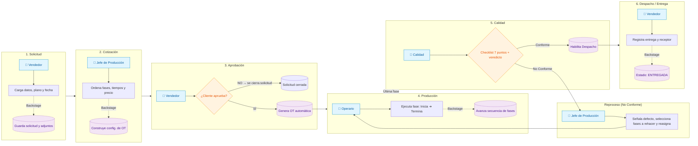

# QualityTrack — Service Blueprint

**Versión:** 2.0 — Actualizado para alinearse con Especificación Funcional v2 (`../funcional/QualityTrack-PRD-v2.md`)

> **Nota v2:** Se corrigió el flujo de rechazo de cotización (se cierra solicitud, no vuelve al Jefe), se actualizó el checklist de Calidad a 7 puntos con 3 valores + veredicto, y se aclaró que Calidad no atribuye la fase de origen.

## Flujo unificado del MVP

### 1. Vista general

**Objetivo del servicio:** permitir que una industria de mecanizado gestione una Orden de Trabajo de punta a punta y pueda reconstruir su historial completo sin recurrir a sistemas, planillas o documentación física dispersa.

**Flujo principal:**

**Solicitud → Cotización → Aprobación → Generación de OT → Producción → Calidad → Despacho → Entrega**

---

## 2. Blueprint del servicio

| Etapa                                  | 1. Solicitud                                                       | 2. Cotización                                                   | 3. Aprobación                                          | 4. Producción                                            | 5. Calidad                                                            | 6. Despacho / Entrega                                    |
| -------------------------------------- | ------------------------------------------------------------------ | --------------------------------------------------------------- | ------------------------------------------------------ | -------------------------------------------------------- | --------------------------------------------------------------------- | -------------------------------------------------------- |
| **Objetivo del usuario**               | Solicitar un trabajo                                               | Obtener una cotización                                          | Confirmar o rechazar precio                            | Fabricar la pieza                                        | Verificar conformidad                                                 | Entregar el trabajo                                      |
| **Actor principal**                    | Vendedor                                                           | Jefe de producción                                              | Vendedor                                               | Operario                                                 | Calidad                                                               | Vendedor                                                 |
| **Acción del usuario**                 | Carga datos del cliente, plano, documentos, notas y fecha esperada | Selecciona y ordena fases, estima tiempos y define precio final | Envía cotización al cliente y registra respuesta       | Ejecuta la fase asignada: comienza → termina             | Ejecuta checklist de 8 puntos y emite veredicto                       | Marca la OT como entregada y registra a quién se entrega |
| **Interacción visible con el sistema** | Formulario de Solicitud + carga de adjuntos                        | Configurador de fases + tiempos + precio                        | Gestión de cotizaciones derivadas                      | Lista de tareas + comenzar / terminar + adjuntos + notas | Lista de OTs pendientes + checklist + observaciones                   | Lista de OTs en Despacho + registro de entrega           |
| **Resultado visible**                  | Solicitud creada                                                   | Cotización lista                                                | Aprobada → genera OT / Rechazada → se cierra solicitud (se carga nueva si es necesario) | Fase terminada                                           | Conforme → Despacho / No conforme → Jefe de Producción (selecciona fases a rehacer)    | OT entregada                                             |
| **Backstage / lógica del sistema**     | Guarda solicitud y documentación                                   | Construye la configuración específica de la OT                  | Si se registra aprobación, genera la OT                | Avanza la OT entre fases según la secuencia definida     | Registra checklist, resultado y observaciones                         | Actualiza estado de entrega                              |
| **Información generada**               | Datos cliente, plano, documentos, notas, fecha esperada            | Fases, orden, tiempos y precio único                            | Respuesta del cliente                                  | Operario, inicio, finalización, notas                    | Checklist, resultado y observaciones                                  | Estado de entrega + persona receptora                    |
| **Evidencia / documentación**          | Solicitud + adjuntos                                               | Cotización                                                      | Registro de respuesta                                  | Historial de operaciones                                 | Auditoría de Calidad                                                  | Registro de entrega                                      |
| **Siguiente estado**                   | Pendiente de cotización                                            | Pendiente de respuesta                                          | OT o nueva cotización                                  | Siguiente fase / Calidad                                 | Despacho o No conforme                                                | Entregada                                                |

---

# 3. Línea de interacción

## Cliente / Solicitud

### Acción

El cliente solicita un trabajo a través del área Comercial.

### Frontstage — Vendedor

1. Registra los datos del cliente.
2. Adjunta el plano y documentación disponible.
3. Agrega notas.
4. Registra la fecha esperada de entrega.

### Backstage

QualityTrack crea la Solicitud y centraliza toda la documentación asociada.

### Evidencia

- Datos del cliente
- Plano
- Documentación
- Notas
- Fecha esperada

---

## Cotización

### Acción

El pedido llega al Jefe de producción.

### Frontstage — Jefe de producción

1. Revisa la solicitud y sus adjuntos.
2. Selecciona las fases necesarias del catálogo global.
3. Ordena las fases según el pedido.
4. Define el tiempo estimado de cada fase.
5. Define un único precio final.
6. Acepta la cotización.

### Backstage

El sistema guarda la configuración específica de esa cotización.

El catálogo global funciona únicamente como fuente de fases disponibles: **no determina el orden de fabricación**.

### Evidencia

- Fases seleccionadas
- Orden de fases
- Tiempo estimado por fase
- Precio final

---

## Aprobación del cliente

### Acción

El Vendedor recibe la cotización preparada.

### Frontstage — Vendedor

1. Envía la cotización al cliente.
2. Registra la respuesta.
3. Selecciona:
   - Aprobada
   - No aprobada

### Backstage

Si la respuesta es **aprobada**, QualityTrack genera la Orden de Trabajo (OT).
Si la respuesta es **no aprobada**, la solicitud queda cerrada sin generar OT. Si el cliente quiere recotizar, se carga una solicitud nueva (este MVP no versiona cotizaciones rechazadas).

> La aprobación no ocurre online dentro del sistema: la registra el Vendedor.

---

# 4. Producción

## Inicio de la OT

### Frontstage — Operario

El operario visualiza únicamente las tareas que tiene asignadas.

La interfaz está pensada para **celular / tablet**, sin necesidad de notebook.

### Estados de una tarea

```text
En cola → En ejecución → Terminado
```

### Acciones

- Comenzar tarea
- Terminar tarea
- Consultar adjuntos
- Consultar vencimiento
- Consultar notas

### Backstage

El sistema registra el historial de cada fase, incluyendo:

- Operario
- Momento de ejecución
- Estado
- Notas

---

## Transición entre fases

Una vez terminada una fase:

**¿Existe una siguiente fase?**

- **Sí:** la OT pasa al operario correspondiente a la siguiente fase.
- **No:** todas las fases fueron completadas y la OT pasa a Calidad.

El orden depende de la configuración realizada por el Jefe de producción para esa OT.

---

# 5. Control de Calidad

## Recepción

### Frontstage — Calidad

Calidad visualiza las OTs que terminaron todas sus fases y están esperando control.

### Acción

Ejecuta el checklist de calidad:

**Puntos 1 a 7** — Cada uno se responde como **Cumple / No cumple / No aplica**:

1. Conformidad dimensional
2. Fases completas
3. Terminación / acabado
4. Cantidad
5. Identificación
6. Prueba funcional, si aplica
7. Documentación de respaldo

**Punto 8 — Resultado:** Conforme / No conforme (con observaciones obligatorias si es No conforme)

---

## Resultado: Conforme

### Frontstage

Calidad selecciona **Conforme**.

### Backstage

El sistema registra:

- Auditoría
- Checklist
- Resultado
- Observaciones, si corresponden

### Siguiente estado

`Calidad → Despacho`

---

## Resultado: No conforme

### Frontstage

Calidad:

1. Selecciona **No conforme**.
2. Registra obligatoriamente las observaciones.
3. Explica qué está mal.

### Backstage

La OT vuelve al Jefe de producción.

El Jefe de producción determina **qué fase o fases puntuales deben rehacerse**.

No necesariamente se rehace toda la OT.

Luego:

1. Selecciona las fases a corregir.
2. Asigna operario(s).
3. Define tiempo.
4. Agrega instrucciones.

### Frontstage — Operario

El operario recibe:

- La tarea reasignada.
- Las notas de Calidad.
- Las instrucciones del Jefe de producción.

Las notas aparecen discriminadas por origen.

### Ciclo de reproceso

`Calidad → No conforme → Jefe de producción → Reasignación → Operario → Calidad`

Este ciclo puede repetirse hasta obtener un resultado **Conforme**.

---

# 6. Despacho y entrega

## Despacho

Cuando Calidad determina que la OT es conforme:

`Calidad → Despacho`

### Frontstage — Vendedor

El Vendedor visualiza las OTs en estado Despacho.

### Acción

Al realizar la entrega:

1. Marca la OT como entregada.
2. Registra el nombre de la persona que recibe.

### Evidencia

- Estado de entrega
- Persona receptora

> El MVP registra la entrega, pero no genera un remito o comprobante formal.

---

# 7. Línea de visibilidad

## Visible para el usuario

- Solicitudes
- Documentación
- Cotizaciones
- Fases
- Tiempos
- Precio final
- Tareas
- Estados de producción
- Adjuntos
- Notas
- Checklist de Calidad
- Resultado de auditoría
- Estado de Despacho
- Registro de entrega

## Detrás de escena

- Creación y transición de estados
- Generación de la OT después de la aprobación
- Asignación / reasignación de tareas
- Registro del historial de operaciones
- Registro de auditorías
- Derivación de no conformidades
- Reingreso de fases a producción

---

# 8. Sistemas y soporte

| Necesidad                        | Soporte del sistema                     |
| -------------------------------- | --------------------------------------- |
| Centralizar documentación        | Expediente asociado a la Solicitud / OT |
| Configurar procesos diferentes   | Catálogo global de fases                |
| Adaptar el proceso a cada pedido | Orden dinámico de fases                 |
| Gestionar producción             | Asignación de tareas a operarios        |
| Gestionar cambios                | Reasignación de OTs                     |
| Controlar calidad                | Checklist de 8 puntos                   |
| Gestionar reprocesos             | Reasignación de fases específicas       |
| Trazabilidad                     | Historial de operaciones por fase       |
| Seguimiento global               | Dashboards por rol                      |
| Configuración de planta          | Dashboard del Gerente                   |

---

# 9. Capa transversal — Gerente de producción

El Gerente no participa directamente en el recorrido de una OT, sino que configura y supervisa el servicio.

## Configuración global

Puede:

- Crear fases.
- Nombrar fases.
- Definir qué operarios pueden ejecutar cada fase.
- Consultar el listado de operarios existentes (cargados directamente en la base por el equipo de desarrollo).

## Vista global de planta

Visualiza:

- OTs pendientes.
- OTs activas.
- Fases existentes.
- Congestión por fase.

No visualiza desempeño individual de operarios; esa responsabilidad corresponde al Jefe de producción.

## Vista global de Calidad

Visualiza:

- % de OTs conformes.
- % de OTs no conformes.
- Retrabajos por fase (cuántas veces se mandó a rehacer cada fase).
- Tiempo promedio en Calidad.
- Últimas auditorías y sus resultados.

---

# 10. Expediente único de la OT

El principal resultado del servicio es que la OT funciona como **punto central de trazabilidad**.

Desde el expediente se puede reconstruir:

### Solicitud

- Datos del cliente
- Plano y documentación
- Notas

### Cotización

- Fases
- Orden
- Tiempos
- Precio final

### Producción

- Historial de operaciones
- Operarios
- Momentos
- Notas

### Calidad

- Checklist
- Auditoría
- Resultado
- Observaciones

### Entrega

- Estado de despacho
- Persona receptora

Esto responde directamente al criterio de éxito del producto: poder tomar una OT y reconstruir el historial completo del trabajo sin buscar información en distintos sistemas, planillas o carpetas.

---

# 11. Blueprint simplificado



---

# 12. Pain point que resuelve

## Antes

```text
Plano ───────────────► carpeta física
Certificado ─────────► bibliorato
Producción ──────────► hojas sueltas
Calidad ─────────────► checklist físico
Entrega ─────────────► registro separado
```

## Con QualityTrack

```text
                    ┌──────────────────┐
                    │       OT         │
                    ├──────────────────┤
                    │ Solicitud        │
                    │ Documentación    │
                    │ Cotización       │
                    │ Producción       │
                    │ Calidad          │
                    │ No conformidades │
                    │ Despacho         │
                    │ Entrega          │
                    └──────────────────┘
```

### Propuesta de valor central

> **Una Orden de Trabajo, un historial completo y una única fuente de verdad.**
