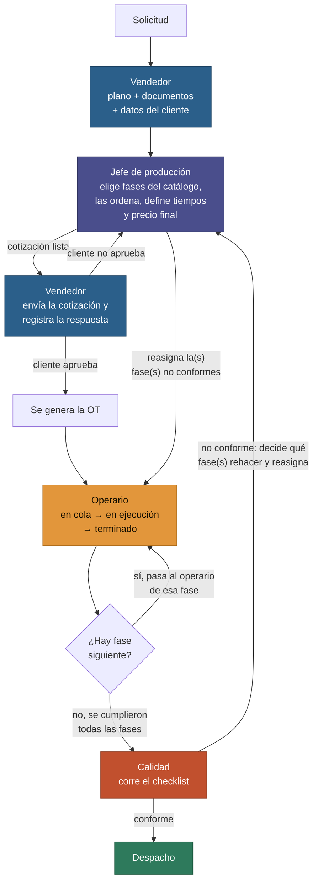

# QualityTrack — Especificación Funcional · Versión 2

Sistema de Gestión de Calidad Industrial — flujo unificado del MVP

| Programa                   | Fecha de definición | Estado        |
|----------------------------|---------------------|---------------|
| NO-Country · Semana 1 de 5 | 04/09/2026           | Flujo cerrado + definiciones técnicas validadas con el equipo |

*Esta versión incorpora 15 definiciones y correcciones que surgieron al construir el esquema de base de datos y contrastarlo contra esta especificación. El detalle de cada una, con su justificación, está en `docs/funcional/QualityTrack-Cambios-PRD-Backlog.md`. Ninguna modifica el flujo cerrado el 01/09 — todas lo precisan.*

---

## 01. El problema

Hoy, en una industria de mecanizado de piezas para clientes industriales, la información de un trabajo viaja dispersa: el plano en una carpeta física, los certificados de materia prima en un bibliorato, los controles de calidad en hojas sueltas. Ante un reclamo o una auditoría, reconstruir el historial completo de una pieza toma horas y depende de encontrar el papel correcto.

## 02. Criterio de éxito

> **Definición del desafío**
> Un usuario debe poder tomar una Orden de Trabajo y, sin buscar en distintos sistemas, planillas o carpetas, reconstruir el historial completo del trabajo y acceder a toda la documentación asociada.

## 03. Roles del flujo

Nombrados desde una mirada de negocio, no técnica, para que todo el equipo los entienda sin ambigüedad.

- **Vendedor** (Comercial) — Carga la solicitud: plano, documentos y datos del cliente. Levanta la cotización.
- **Jefe de producción** (Producción) — Configura la cotización: fases, orden, tiempos y precio final. Asigna y reasigna operarios.
- **Operario** (Planta) — Ejecuta su fase: en cola, en ejecución, terminado. Solo ve lo que tiene asignado.
- **Calidad** (Control) — Corre el checklist final antes de despacho. Puede rechazar y devolver a producción.

## 04. Flujo unificado

*La aprobación del cliente la registra el Vendedor (no es una aprobación online directa). Si Calidad rechaza, el Jefe de producción decide qué fase o fases puntuales hay que rehacer — no necesariamente todas — y reasigna.*

*El estado comercial del pedido (enviada al cliente / aprobada / no aprobada) vive únicamente en la cotización — la solicitud solo registra si ya fue cotizada o no. Si el cliente no aprueba y hay que recotizar, en este MVP se carga una solicitud nueva: no hay versionado de cotizaciones rechazadas.*

Referencia de colores: Vendedor · Jefe de producción · Operario · Calidad · Despacho.

## 05. Catálogo global de fases

El Gerente define, a nivel global, cuántas fases existen, su nombre y qué operarios pueden ejecutar cada una — sin orden fijo de fábrica. El Jefe de producción arma la secuencia real caso por caso, según el pedido, y **una misma fase puede repetirse dentro de la secuencia de una OT** (por ejemplo, Mecanizado → Soldadura → Mecanizado). Así el mismo sistema sirve para cualquier industria de mecanizado sin tocar código.

- **Taller de matrizado**: Corte → Plegado → Soldadura
- **Fábrica de válvulas**: Fundición → Mecanizado → Ensamble → Prueba

## 06. Reglas clave

1. La cotización lleva **un único precio final** — no hay precio por fase.
2. El Jefe de producción sí estima **un tiempo por fase**, para su propia planificación.
3. El **orden de las fases** se arma pedido por pedido — el catálogo no impone secuencia.
4. La OT puede **reasignarse** a otro operario en cualquier momento del ciclo, y esa reasignación queda registrada en el historial de la fase.

## 07. Dashboards por rol

Detalle funcional de los 5 dashboards del sistema, cerrados con el equipo.

### Vendedor

- **Levantar pedido (Solicitud)**: adjunta documentación, notas del cliente, datos de contacto (nombre, dirección, teléfono), una **descripción de la pieza o trabajo solicitado**, la **cantidad de unidades** (mismo tipo de pieza, puede ser una o varias) y la fecha esperada de entrega que pide el cliente. *Esta fecha es un dato informativo: no dispara alertas ni condiciona la planificación de fases.*
- **Buscar órdenes (expediente completo)**: encuentra una OT y abre su expediente completo: datos de la solicitud, la cotización (fases, tiempos, precio), el historial de operaciones por fase (operario, momento, notas — incluyendo reasignaciones y retrabajos), el resultado de Calidad (checklist y veredicto), y el estado de entrega. Por ahora esta vista consolidada solo la ve el Vendedor.
- **Cotizaciones derivadas**: ve las cotizaciones que el Jefe de producción ya armó para sus solicitudes. Marca si ya la envió al cliente y registra la respuesta (aprobada o no) — este estado comercial se guarda en la cotización, es el único lugar del sistema donde vive. Si la aprueba, confirmar esa aprobación es lo que dispara la generación de la OT. Si el cliente no aprueba, la solicitud queda cerrada sin generar OT; para recotizar, se carga una solicitud nueva.
- **Despacho / Entrega**: ve las OTs que están en estado Despacho y las marca como entregadas, indicando el nombre de la persona a quien se le entrega.

### Jefe de producción

- **Recepción de cotización**: recibe la solicitud del Vendedor, ve los planos/documentación adjunta, arma dinámicamente las fases (las elige y ordena del catálogo, pudiendo repetir una fase en la secuencia si el proceso lo requiere), les carga el tiempo estimado a cada una, define el valor total de la cotización, y le da "aceptar" para que vuelva al Vendedor.
- **Gestión de planta**: ve a todos sus operarios, qué OTs tiene asignada cada uno y su cantidad de trabajo/órdenes pendientes, y puede reasignar una OT de un operario a otro. **Cada reasignación queda registrada** (quién la tenía, quién la recibe, cuándo), para que el expediente del Vendedor pueda mostrarla.
- **No conformidades**: ve las OTs que Calidad marcó como no conformes. Como una OT puede tener varias fases, no hay que rehacerlas todas — decide qué fase(s) puntuales corregir, les asigna operario(s) y tiempo, y deja notas que el operario va a ver. Calidad no indica de qué fase vino la falla — observa el defecto sobre la pieza terminada, sin necesariamente saber en qué etapa se originó; es el Jefe quien hace ese diagnóstico según su conocimiento del proceso.

### Operario

*Pensado para celular / tablet — sin notebook.*

- **Tareas en ejecución y pendientes**: ve sus tareas en ambos estados, con botón para comenzar y botón para terminar. Nada más — interfaz mínima a propósito, sin campos para agregar notas ni documentación propia.
- **Adjuntos**: ve los adjuntos de la tarea (planos u otra documentación), si existen.
- **Vencimiento**: ve el tiempo de vencimiento de la tarea. *Se calcula hacia adelante: en el momento en que la fase entra en su cola, se suma el tiempo estimado que cargó el Jefe de producción y ese es el vencimiento que ve.*
- **Notas, discriminadas por origen**: exactamente dos orígenes posibles — las de Calidad (motivo de la no conformidad) y las del Jefe de producción (instrucciones al reasignar) — se ven identificadas por separado, nunca mezcladas.

### Calidad

- **Órdenes terminadas**: ve las OTs que llegan desde Operario, esperando control. Se ordenan por antigüedad en la cola, contada desde que el operario de la última fase marcó "terminar".
- **Auditoría**: corre el checklist de 8 puntos (sección 08) sobre la OT. Cada uno de los 7 primeros puntos se responde como **Cumple / No cumple / No aplica**.
- **Veredicto**: aprueba → deriva a Despacho. No conforme → deriva al Jefe de producción, con notas explicando qué está mal (son las que después ve el Operario, marcadas como de Calidad). Calidad señala el defecto observado, no la fase de origen — esa asignación queda del lado del Jefe de producción. Interfaz simple, sin funcionalidad adicional.

### Gerente

- **Configuración global**: crea y nombra las fases del catálogo (las guarda), y para cada una define las responsabilidades — qué operario(s) individuales pueden ejecutarla (la habilitación es por operario, no por tipo de tarea general). Los usuarios del sistema —incluidos los operarios— se cargan directamente en la base durante la implementación; el Gerente consulta el listado de operarios existentes y les asigna las fases habilitadas, pero no da de alta usuarios nuevos desde el sistema.
- **Vista global de planta**: cantidad de OTs pendientes/activas, las fases que existen en el catálogo, y la congestión por fase (cuántas OTs acumuladas en cada una). No incluye desempeño por operario individual — eso queda del lado del Jefe de producción.
- **Vista global de Calidad**: indicadores de % de OTs conformes vs. no conformes, **retrabajos por fase** (cuántas veces se mandó a rehacer cada fase — si un rechazo deriva en rehacer dos fases, cuenta como dos retrabajos), tiempo promedio en Calidad (medido desde que el operario de la última fase termina hasta el veredicto — no desde que el auditor abre la OT), y últimas auditorías con su resultado.

## 08. Checklist de Calidad

Lo que revisa Calidad antes de dar el pase a Despacho. Los puntos 1 a 7 se responden individualmente como **Cumple / No cumple / No aplica** — el tercer valor cubre los casos donde el punto no corresponde al producto (por ejemplo, una prueba de hermeticidad en una pieza que no lo requiere).

1. Conformidad dimensional: la pieza cumple las medidas y tolerancias del plano/requerimiento cargado en la solicitud.
2. Fases completas: todas las fases asignadas a la OT figuran como "terminado".
3. Terminación/acabado: sin defectos superficiales visibles (rebabas, rayones, deformaciones, oxidación), según material y proceso.
4. Cantidad: lo producido coincide con la cantidad indicada en la cotización.
5. Identificación: la pieza está correctamente marcada con el número de OT.
6. Prueba funcional (si aplica al producto): cumple su función prevista — ajuste, movimiento, hermeticidad, resistencia, etc.
7. Documentación de respaldo: los documentos adjuntos a la OT (plano, certificados, órdenes de compra) están completos y corresponden a la pieza.
8. **Resultado**: Conforme / No conforme, con observaciones obligatorias si es "No conforme" — es lo que ve el Jefe de producción cuando rebota la OT.

## 09. Para más adelante

*No P0 — no considerar todavía*

- Automatización del precio por variables (si el cronograma lo permite).
- **Alta de operarios por el Gerente** desde el sistema, con una solución de credenciales definida (hoy los carga el equipo de desarrollo directamente en la base).
- **Recotización con historial de versiones**: hoy, si el cliente rechaza, se carga una solicitud nueva; una siguiente iteración podría permitir recotizar la misma solicitud conservando las versiones anteriores.
- **Entregas parciales**: hoy una OT se entrega completa a una sola persona; una siguiente iteración podría permitir entregar en varios envíos, sumando cantidades hasta cerrar el total.

## 10. Fuera de la consigna de NO-Country

Comparación del plan actual contra la consigna original del desafío (02/09/2026). El expediente único de la OT también faltaba y se resolvió ampliando "Buscar órdenes" del Vendedor (sección 07). Estos cinco puntos quedan fuera del plan por ahora:

1. **Certificados de materia prima**: sin un lugar específico para cargarlos; hoy entran solo como documentación genérica de la Solicitud.
2. **Órdenes de compra**: no contempladas en ningún dashboard.
3. **Facturas y comprobantes**: no hay facturación ni comprobantes de pago; el flujo solo define un precio único en la cotización.
4. **Documento/comprobante formal de entrega**: se registra el nombre de a quién se entrega, pero no se genera un remito o comprobante como documento en sí.
5. **Indicadores de producción y de entregas**: lo definido son indicadores de Calidad y de congestión de planta; no hay indicador de volumen de producción ni de entregas en un período.

---

El flujo se definió en la reunión de unificación del 01/09/2026, a partir de la propuesta de María Chiribao de abordar el proyecto no como una industria particular sino pensado para una industria general. El desarrollo del flujo se hizo en conjunto entre todos los presentes: María Chiribao, Felipe Arroyo, Alicia Zuñega, Alfredo Aguero Ortiz, Maira Gonzalez y Mel Zarate. Los documentos iniciales — spec técnico y esquema de base de datos — quedaron como referencias históricas iniciales.

Esta versión 2 incorpora las definiciones y correcciones surgidas al construir el esquema de base de datos (`docs/datos/QualityTrack-Esquema-Base-Datos-v2.md`), validadas con el equipo el 04/09/2026. El detalle punto por punto está en `docs/funcional/QualityTrack-Cambios-PRD-Backlog.md`.

**Documentos y autores**

- María Chiribao — "QualityTrack — Especificación Funcional y Arquitectura de Producto" y "Macro sistema software MVP"
- Mel Zarate — spec-tecnico-v1.md, consolidación v2 de esta especificación y del esquema de base de datos
- Abel Fucili — diagrama_er_qualitytrack.html, PASO_1_Diseño_Modelo_Datos.md, PASO_1B_Claves_Relaciones_1.md, RESUMEN_PASO_1_Para_Equipo_2.txt
