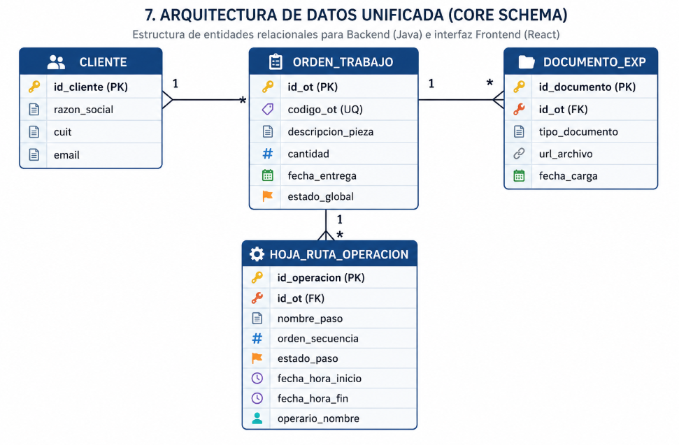
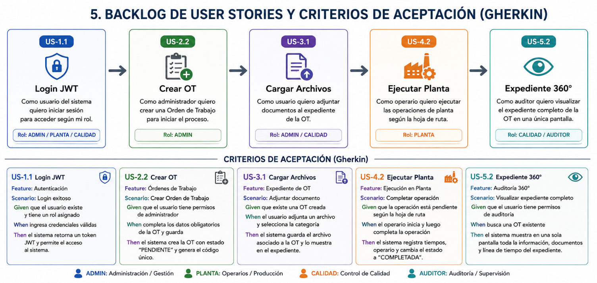
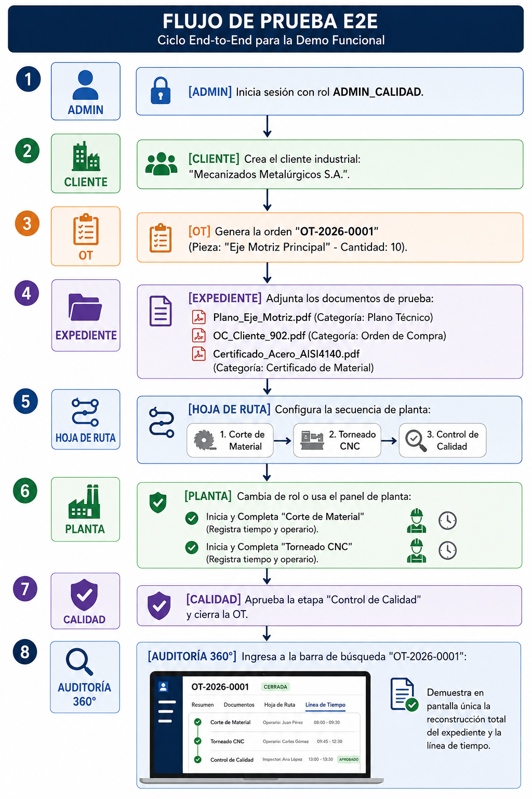

# Macro sistema software MVP

> **Nota de contexto — documento de investigación inicial**
>
> Este documento corresponde a una etapa inicial de investigación y relevamiento del dominio industrial considerado para el proyecto QualityTrack.
>
> En esta instancia se analizaba la posibilidad de orientar la solución hacia una empresa de **aberturas** y, a partir de ese escenario, se investigaron procesos, entidades y posibles funcionalidades asociadas a la industria de fabricación de partes.
>
> Las propuestas, hipótesis y User Stories incluidas en este documento pertenecen a esa etapa exploratoria. **No constituyen el Backlog vigente del producto ni deben interpretarse como la definición funcional actual de QualityTrack.**
>
> Para la definición vigente del proyecto deben tomarse como fuentes de referencia el **PRD V2**, el **Backlog V2** y el **Esquema de Base de Datos V2**.
>
> El documento se conserva como antecedente de análisis del dominio y como registro de la evolución que llevó posteriormente a un enfoque de trazabilidad industrial más general y agnóstico del tipo de producto fabricado.

## Imágenes del documento original

1. Desacoplar el Software de una Industria Específica

En lugar de programar lógica rígida para un nicho (como "mecanizado de ejes" o "aberturas"), el sistema opera sobre la abstracción del Expediente Único de la OT.

Para QualityTrack, cualquier trabajo industrial se reduce a un esquema universal:

Así, el software funciona igual de bien para un taller que mecaniza piezas para petroleras, una fábrica de válvulas o un taller de matrizado, etc.

2. Cumplen 100% con la Consigna Oficial y el Criterio de Éxito

La consigna del cliente no pide reglas de negocio específicas de un tipo de pieza. Pide resolver el problema de la dispersión de información y la falta de trazabilidad:

"El criterio de éxito será si un usuario puede tomar una Orden de Trabajo y, sin buscar en diferentes carpetas o planillas, reconstruir el historial completo y acceder a su documentación asociada."

Centrar la demo en demostrar que con ingresar el código OT-1042 se despliegan sus planos, su historial de operaciones en planta y sus certificados de calidad, el proyecto es 100% exitoso según la rúbrica de evaluación.

3. Simplifican la Carga de Trabajo del Equipo

Al eliminar especificidades del tipo de producto (sin catálogos rígidos, sin tablas numéricas complejas de material, sin inventarios dinámicos):

Frontend: Construyen componentes limpios y reutilizables (formularios genéricos de OT, listas de adjuntos, líneas de tiempo/Kanban para operaciones).

Backend: Diseñan un modelo de datos robusto, limpio y escalable basado en relaciones simples (Cliente - OT - Documento - OperacionHojaRuta).

QA: Validan un flujo E2E claro y predecible, sin casos borde infinitos derivados de reglas específicas de producción.

Arquitectura y estrategia de producto: el software no debe saber qué se fabrica, sino cómo garantiza la trazabilidad de lo que fabrica.

"El foco de QualityTrack es la trazabilidad agnóstica de la Orden de Trabajo. No necesitamos encasillar el sistema en un producto o tipo de fábrica en particular. Nos enfocamos en digitalizar el recorrido genérico que describe el problema: desde que entra la solicitud hasta la entrega, vinculando sus documentos y su hoja de ruta en una vista 360°.

Esto nos permite entregar un sistema funcional, profesional y libre de fricciones en 5 semanas."

Matriz de Historias de Usuario

## Matriz de Historias de Usuario

| ID US | Rol | Requerimiento / Historia | Criterio de Aceptación (Gherkin) |
| --- | --- | --- | --- |
| US-1.1 | Usuario | Iniciar sesión con email/password | Dado credenciales válidas, cuando hace clic en "Iniciar Sesión", entonces responde HTTP 200 con JWT. |
| US-2.2 | Admin Calidad | Alta de Orden de Trabajo | Dado datos completos de la OT, cuando confirma la creación, entonces genera código OT-2026-0001 y estado Borrador. |
| US-3.1 | Admin Calidad | Carga de archivos al expediente | Dado un archivo .pdf o .png <10MB, cuando selecciona categoría y sube, entonces se vincula al expediente. |
| US-4.2 | Operario | Registro de avance en planta | Dado un paso Pendiente, cuando presiona "Iniciar", entonces cambia a En Curso y guarda el timestamp del servidor. |
| US-5.2 | Auditor | Consulta de Expediente 360° | Dado un código de OT en el buscador, cuando consulta, entonces despliega en pantalla única datos, archivos y timeline |

## Relación con la documentación vigente

Este material debe leerse como **antecedente histórico de investigación**, no como una especificación funcional vigente.

Durante la evolución del proyecto, el enfoque pasó de evaluar una solución asociada a una industria/producto particular a un modelo de **trazabilidad agnóstica de la Orden de Trabajo**, donde el sistema se centra en reconstruir el recorrido de una pieza o trabajo desde la solicitud hasta la entrega.

Por este motivo, algunas historias de usuario de esta investigación inicial presentan roles, estados o comportamientos que posteriormente serán redefinidos.

La validación funcional del QualityTrack se realizán contra las fuentes vigentes del proyecto.
